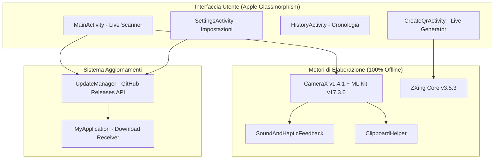
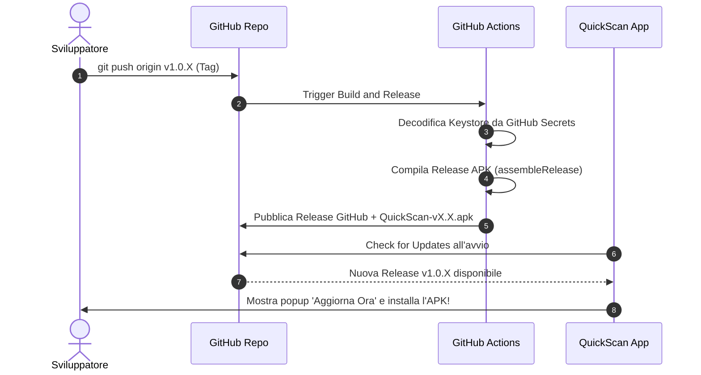

<div align="center">

# 📱 QuickScan — Scanner QR & Codici a Barre

[](https://github.com/gmaclol/Scanner-qr/releases/latest)
[](https://github.com/gmaclol/Scanner-qr)
[](https://kotlinlang.org)
[](LICENSE)

**Un'applicazione Android nativa, ultra-veloce, lightweight e dal design premium in stile Apple iOS / Glassmorphism per la scansione istantanea e la generazione personalizzata di codici QR e codici a barre.**

[📥 Scarica Ultimo APK](https://github.com/gmaclol/Scanner-qr/releases/latest) • [✨ Funzionalità](#-funzionalità-principali) • [🏗️ Architettura](#️-architettura--stack-tecnologico) • [🚀 CI/CD & Auto-Update](#-cicd--auto-update-automatico)

</div>

---

## 📸 Caratteristiche in Evidenza

- ⚡ **Scansione Istantanea a 60/120 FPS**: Apertura immediata della fotocamera con rilevamento hardware-accelerato tramite **Google ML Kit**.
- 🍎 **Design System Apple iOS**: Palette OLED Black (`#000000`), frosted glass blur, angoli curvi, bottoni a pillola e transizioni con curve di interpolazione fluide.
- 🎯 **Mirino Laser Animato**: Scanner reticle con fascio laser blu gradiente che scansiona continuamente il codice.
- 🔔 **Feedback Aptico + Sonoro**: Beep istantaneo e vibrazione ad ogni scansione riuscita.
- 📋 **Copia Automatica negli Appunti**: Copia immediata del contenuto scansionato con **Dynamic Island Pill** animata dall'alto (*"Copiato negli appunti!"*).
- 🛠️ **Generatore QR con Condivisione Universale**: Creazione in tempo reale di QR per 7 tipologie di contenuto, esportazione in Galleria e condivisione istantanea tramite share sheet nativo.
- 📜 **Cronologia Completa**: Salvataggio automatico di tutte le scansioni e creazioni con ricerca e copia rapida.
- 🔄 **In-App Auto-Update**: Notifica automatica e installazione con un tocco direttamente dalle GitHub Releases.

---

## ✨ Funzionalità Principali

### 1. 📷 Scanner Multi-Formato (CameraX + ML Kit)
Supporto completo offline per tutti i formati standard:
- **Codici 2D**: QR Code, Data Matrix, Aztec, PDF417
- **Codici 1D / Barcode**: EAN-13, EAN-8, UPC-A, UPC-E, Code 128, Code 39, Code 93, Codabar, ITF

Azioni intelligenti nel Bottom Sheet:
- 🌐 **Apri URL** (con opzione di auto-apertura nelle impostazioni)
- 📞 **Chiama numero telefonico**
- 📶 **Connetti a rete Wi-Fi**
- 🔍 **Cerca sul Web**
- 📤 **Condividi / Copia**

### 2. 🎨 Generatore Codici QR Integrato
Genera codici QR ad alta definizione al volo per:
| Tipo | Dati Supportati |
|------|-----------------|
| **Testo Libero** | Qualsiasi testo, appunto, codice seriale |
| **Sito Web (URL)** | Link web `https://...` |
| **Wi-Fi** | Rete con SSID + Password WPA/WEP |
| **Contatto (vCard)** | Nome, Telefono ed Email |
| **Telefono** | Composizione diretta `tel:...` |
| **Email** | Indirizzo email + Oggetto precompilato |
| **SMS** | Numero destinatario + Messaggio |

### 3. ⚙️ Impostazioni Personalizzabili
- Toggle suono di notifica
- Toggle vibrazione aptica
- Toggle copia automatica negli appunti
- Toggle apertura automatica degli URL
- Pulsante *"Verifica Aggiornamenti"* con versione app visualizzata

---

## 🏗️ Architettura & Stack Tecnologico



| Componente | Tecnologia |
|------------|------------|
| **Linguaggio** | Kotlin 2.1.0 |
| **Min SDK / Target SDK** | Android 8.0 (API 26) / Android 15 (API 35) |
| **Build Tool** | Gradle 9.3.1 + AGP 8.13.2 |
| **Fotocamera** | AndroidX CameraX (Core, Camera2, Lifecycle, View) |
| **Scansione Barcode** | Google ML Kit Barcode Scanning |
| **Generazione QR** | ZXing Core |
| **Rete & JSON** | OkHttp 4.12.0 + Gson 2.11.0 |
| **Persistenza Dati** | SharedPreferences + Gson |

---

## 🚀 CI/CD & Auto-Update Automatico

Il progetto include una pipeline **GitHub Actions** completa ([`.github/workflows/release.yml`](.github/workflows/release.yml)):



### Come creare una nuova Release:
1. Incrementa `versionCode` e `versionName` in [`app/build.gradle.kts`](app/build.gradle.kts).
2. Esegui:
   ```bash
   git add app/build.gradle.kts
   git commit -m "chore(release): bump version v1.0.2"
   git push origin master
   git tag v1.0.2
   git push origin v1.0.2
   ```
3. GitHub Actions compilerà e pubblicherà automaticamente la release con l'APK firmato.

---

## 📥 Installazione

1. Vai nella pagina [**Releases**](https://github.com/gmaclol/Scanner-qr/releases).
2. Scarica il file `QuickScan-vX.X.X.apk`.
3. Apri il file scaricato sul tuo smartphone Android e conferma l'installazione.

---

## 🔒 Privacy & Sicurezza

- **Nessuna Telemetria Invasiva**: Nessun tracciamento dati, nessun analytics esterno.
- **Scansione Locale**: L'analisi della fotocamera avviene 100% on-device. Nessuna immagine o codice viene inviato a server esterni.
- **Sicurezza delle Chiavi**: Segreti e file keystore `.jks` sono protetti tramite `.gitignore` e gestiti tramite GitHub Secrets crittografati.

---

## 👨‍💻 Autore

Sviluppato da **[gmaclol](https://github.com/gmaclol)** con ❤️ e focus su velocità ed estetica.
